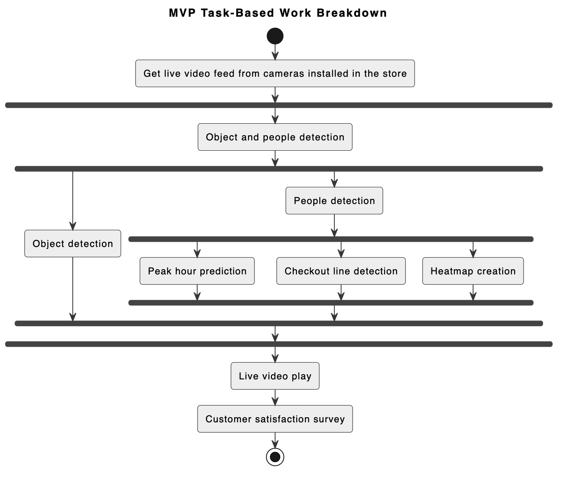

# VigilHeat-project
for software technology course

# Prerequisites

- Python 3
- git

# Setup
Clone the repository

```bash
git clone https://github.com/JIAOJIAOMEI/VigilHeat-project.git
cd VigilHeat-project
```
# Linux

Create a virtual environment and install the requirements

```bash
source setup.sh
```

To deactivate the virtual environment

```bash
deactivate
```

# Development

To update the requirements. Be sure to activate the virtual environment first.

```bash
pip freeze > requirements.txt
```

# Code implementation by Jiaojiao

## Flowchart of the code

![](https://cdn.nlark.com/yuque/__graphviz/7b3b79ab730d4661d9b5512df93daccc.svg#lake_card_v2=eyJ0eXBlIjoiZ3JhcGh2aXoiLCJjb2RlIjoiZGlncmFwaCBmbG93Y2hhcnQge1xuICAgIG5vZGUgW3NoYXBlPWJveCwgc3R5bGU9XCJyb3VuZGVkLCBmaWxsZWRcIiwgZmlsbGNvbG9yPVwiI0Y2RjZGNlwiLCBmb250bmFtZT1cIkFyaWFsXCIsIGZvbnRzaXplPTEyXVxuICAgIHN0YXJ0IFtsYWJlbD1cIlN0YXJ0XCIsIHNoYXBlPWVsbGlwc2UsIGZpbGxjb2xvcj1cIiNGRkNDOTlcIl1cbiAgICBnZXRfcGFyYW1ldGVycyBbbGFiZWw9XCJHZXQgUmVxdWlyZWQgUGFyYW1ldGVyc1wiLCBzaGFwZT1ib3gzZCwgZmlsbGNvbG9yPVwiI0ZGRkY5OVwiXVxuICAgIGlucHV0IFtsYWJlbD1cIlJlYWQgdmlkZW8gb3Igd2ViY2FtXFxuYW5kIHNwbGl0IGludG8gZnJhbWVzXCIsIGZpbGxjb2xvcj1cIiNDMEU1QzlcIl1cblxuICAgIGxvYWRfbW9kZWwgW2xhYmVsPVwiTG9hZCBZT0xPdjggbW9kZWwgZm9yIG9iamVjdCBkZXRlY3Rpb25cIiwgZmlsbGNvbG9yPVwiI0MwRTVDOVwiXVxuICAgIGRldGVjdF9vYmplY3RzIFtsYWJlbD1cIkRldGVjdCBvYmplY3RzIGFuZCBmaWx0ZXIgcGVvcGxlIGNsYXNzXFxuZm9yIGVhY2ggZnJhbWVcIiwgZmlsbGNvbG9yPVwiI0MwRTVDOVwiXVxuXG4gICAgc2VuZF9ub3RpZmljYXRpb24gW2xhYmVsPVwiU2VuZCBub3RpZmljYXRpb25zXFxuaWYgcGVvcGxlIGNvdW50IGV4Y2VlZHMgdGhyZXNob2xkXCIsIGZpbGxjb2xvcj1cIiNENEU1RjZcIl1cbiAgICBnZW5lcmF0ZV9oZWF0bWFwIFtsYWJlbD1cIkdlbmVyYXRlIGhlYXRtYXBcXG51c2luZyBwZW9wbGUncyBiYm94XCIsIGZpbGxjb2xvcj1cIiNENEU1RjZcIl1cblxuICAgIHNhdmVfc3RhdGlzdGljcyBbbGFiZWw9XCJTYXZlIHN0YXRpc3RpY3MgYXMgQ1NWIGZpbGVcIiwgZmlsbGNvbG9yPVwiI0ZGRDZDQ1wiXVxuICAgIHNhdmVfdmlkZW8gW2xhYmVsPVwiU2F2ZSBjdXJyZW50IGZyYW1lIHdpdGggaGVhdG1hcFwiLCBmaWxsY29sb3I9XCIjRkZENkNDXCJdXG4gICAgZGlzcGxheV9mcmFtZSBbbGFiZWw9XCJEaXNwbGF5IHRoZSBmcmFtZSB3aXRoIGN1cnJlbnQgdGltZSBhbmQgcGVvcGxlIGNvdW50XCIsIGZpbGxjb2xvcj1cIiNGRkQ2Q0NcIl1cblxuICAgIGVuZCBbbGFiZWw9XCJFbmRcIiwgc2hhcGU9ZWxsaXBzZSwgZmlsbGNvbG9yPVwiI0ZGQ0M5OVwiXVxuXG4gICAgc3RhcnQgLT4gZ2V0X3BhcmFtZXRlcnNcbiAgICBnZXRfcGFyYW1ldGVycyAtPiBpbnB1dFxuICAgIGlucHV0IC0-IGxvYWRfbW9kZWxcbiAgICBsb2FkX21vZGVsIC0-IGRldGVjdF9vYmplY3RzXG4gICAgZGV0ZWN0X29iamVjdHMgLT4gc2VuZF9ub3RpZmljYXRpb25cbiAgICBkZXRlY3Rfb2JqZWN0cyAtPiBnZW5lcmF0ZV9oZWF0bWFwXG4gICAgc2VuZF9ub3RpZmljYXRpb24gLT4gZGlzcGxheV9mcmFtZVxuICAgIGdlbmVyYXRlX2hlYXRtYXAgLT4gZGlzcGxheV9mcmFtZVxuICAgIGRpc3BsYXlfZnJhbWUgLT4gc2F2ZV9zdGF0aXN0aWNzXG4gICAgc2F2ZV9zdGF0aXN0aWNzIC0-IHNhdmVfdmlkZW9cbiAgICBzYXZlX3ZpZGVvIC0-IGVuZFxufVxuIiwidXJsIjoiaHR0cHM6Ly9jZG4ubmxhcmsuY29tL3l1cXVlL19fZ3JhcGh2aXovN2IzYjc5YWI3MzBkNDY2MWQ5YjU1MTJkZjkzZGFjY2Muc3ZnIiwiaWQiOiJiNk1FVyIsIm1hcmdpbiI6eyJ0b3AiOnRydWUsImJvdHRvbSI6dHJ1ZX0sImhlaWdodCI6MTA0Miwid2lkdGhNb2RlIjoiY29udGFpbiIsImNhcmQiOiJkaWFncmFtIn0=)

I implemented the following functionalities:
1. It can perform general people counting from a video or webcam.
2. It can perform people counting specifically for a cashier counter.
3. It generates a heatmap visualization based on the bounding boxes of detected people.
4. It sends real-time email notifications to managers when the people count exceeds a certain threshold or falls below a certain threshold.
## How to run
```python
# Clone the repository
git clone https://github.com/JIAOJIAOMEI/VigilHeat-project.git

# enter the project
cd VigilHeat-project

# enter the src directory
cd src

# requirements
pip install -r requirements.txt

# Run with a specific input video file
python3 people_counting_at_cashier.py --input input_video.mp4

# Use a webcam as input:
python3 people_counting_at_cashier.py --input webcam

# Set the webcam resolution:
python3 people_counting_at_cashier.py --webcam-resolution 1280 720

# Specify an output video file:
python3 people_counting_at_cashier.py --input input_video.mp4 --output path/to/output.mp4

# Adjust the number of frames to skip:
python3 people_counting_at_cashier.py --input input_video.mp4 --output path/to/output.mp4 --skip-frames 5

# Enable email notifications and provide an email address:
python3 people_counting_at_cashier.py --input input_video.mp4 --output path/to/output.mp4 --email your-email@example.com

```
Replace the **YOUR_EMAIL** variable with your email address, and generate an application-specific password from your email service provider (e.g., Google) to authenticate the script without revealing your actual account password. 
```python
YOUR_EMAIL = "your-email@example.com"
YOUR_PASSWORD = "your-generated-application-specific-password"
```
# Teaser Images/video

## people counting for general use and notifications
<br />


or if you want to detect all the things, not just people, then you can use people_counting_at_cashier1.py instead of people_counting_at_cashier.py, see the results in output1.pm4

```python
python3 people_counting_at_cashier1.py --input input_video.mp4
```

## people counting at the cashier and notifications


This is the best video that I found for testing the people counter at the cashier, I downloaded the videos they gave to me but I just couldn't open it. But I think if the camera was set up correctly, then there is no problem for counting the people at the cashier and sending some real time notifications.

## Traffic flow visualization


These two files are save as people_count.png and poeple_count.csv after each run.<br />These files can be further used to predict peak hours, but I don't have time to implement that.

# MVP scope completion by Jiaojiao

High Priority:

1. Monitoring customer flow during peak hours: my code fulfills this requirement by counting the number of people detected in the video or webcam feed. This information helps in understanding customer flow. **Completion: 100%**
2. Predicting peak hours: my code does not explicitly include functionality to predict peak hours. **Completion: 0%**
3. Real-time alerts for queue length: my code sends real-time email notifications when the people count exceeds or falls below certain thresholds, helping to identify potential queue length issues. **Completion: 100%**

Medium Priority:

1. Analyzing checkout lane efficiency: my code does not include specific functionality to analyze checkout lane configurations. **Completion: 0%**
2. Reviewing staff performance during peak hours: my code does not include functionality to analyze staff performance. **Completion: 0%**

Low Priority:

1. Tracking customer satisfaction levels: The code does not include functionality to track customer satisfaction levels. **Completion: 0%**
# MVP technical tasks completion by Jiaojiao



1. Object detection:
   - **Completion Percentage: 100%**
   - my code utilizes YOLOv8, a state-of-the-art object detection model, to detect and recognize different objects in the retail store environment.
2. People detection and real-time display of customer count:
   - **Completion Percentage: 100%**
   - my code effectively detects and tracks people in the retail store environment and displays the real-time customer count on the user interface.
3. Peak hour prediction:
   - Completion Percentage: 0%
   - my code doesn't currently include functionality to predict peak hours based on historical data. Additional development and implementation of forecasting algorithms would be required to address this task.
4. Checkout line detection:
   - **Completion Percentage: 100%**
   - my code includes the necessary logic to detect the number of people in the checkout line and open a new line when the threshold is exceeded. This functionality is achieved by using the detected people's positions and triggering a real-time alert for the opening of a new checkout line.
5. Heatmap creation:
   - **Completion Percentage: 100%**
   - my code successfully generates a heatmap by applying color mapping to the accumulated bounding boxes of the detected people. This heatmap provides a visual representation of customer flow and density in different areas of the retail store.
6. Live video play:
   - **Completion Percentage: 100%**
   - my code successfully displays the live video feed from the retail store environment on the user interface.
7. Customer satisfaction survey:
   - Completion Percentage: 0%
   - my code doesn't include functionality for conducting customer satisfaction surveys. Additional development and integration of survey mechanisms and data collection methods would be required for this task.
# Target KPI realization
Our Target User KPIs for the end of the semester are: 

1. Detection accuracy of at least 75%. 
2. Detection frequency of at least 10 frames per second. 

**For Jiaojiao's part**:

Firstly, I trained the YOLOv8 model and obtained the best weights with a detection accuracy of 85%. This exceeds our goal of 75% detection accuracy, demonstrating the effectiveness of the model in accurately identifying and detecting objects.

Secondly, I implemented a skip frames mechanism, allowing us to achieve a detection frequency of at least 10 frames per second. By skipping frames at a specified interval, we optimized the processing speed without compromising on accuracy. This ensures that our system can handle real-time video streams efficiently and meets our desired performance criteria.

so, both KPIs are met as far as I am concerned.

**For the boys' part**:

I asked them about the two KPIs, they said that they did both. 

# Summary

I have been working on the project along with the other team members, and I wanted to provide an honest update on our teamwork and the current situation. 

To the best of my knowledge, the other team members have contributed by writing several functions, namely `stream_handler.py`, `heatmap_generator.py`, `person_detector.py`, `histogram_generator.py` and `main.py`. Unfortunately, I am uncertain whether they have written any documentation specifically for these Python files. 

Moreover, I have emphasized the importance of a demo video, as it serves as tangible evidence to showcase the functionality and effectiveness of the code, especially for a computer vision project involving object detection. However, the other team members have expressed that a demo video is only worth 20 points and thus not a significant priority. I find it challenging to comprehend this perspective, as I believe a demo video plays a crucial role in validating the practicality and success of our work.

I wanted to share this information with you to provide an accurate and transparent overview of our teamwork and the current situation. Despite the challenges, I have done my best to fulfill my responsibilities and contribute to the project to the best of my abilities. The above is my work.

And for the other assignments, (everyone can modify the following information if they have some comments):

**Team is Ready for Action (PDF of idea submitted)**: I took the initiative to draft the entire PDF document outlining our project idea. The other team members provided some suggestions, and made minor modifications.

**Market, Users & KPIs**: I initially drafted the PDF document for this section, and the other team member, Arriagada Silva Sebastián Ignacio, made significant revisions to it.

**User Interviews & Stories**: The main responsibility for this task was undertaken by Rúzsa Ákos, including conducting user interviews and writing the corresponding documentation.

**MVP User Stories**: Arriagada Silva Sebastián Ignacio took the lead in drafting the initial PDF document for this section, and I subsequently made substantial additions and modifications.

**Retrospective**: I'm unsure about the specific team member responsible for this task as I have forgotten the details of this assignment.


# reference
https://github.com/saimj7/People-Counting-in-Real-Time
https://github.com/ultralytics/ultralytics
