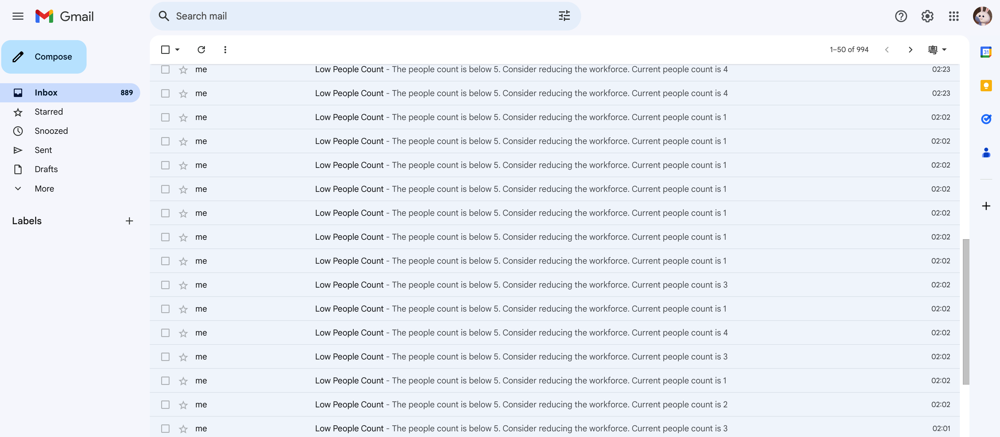
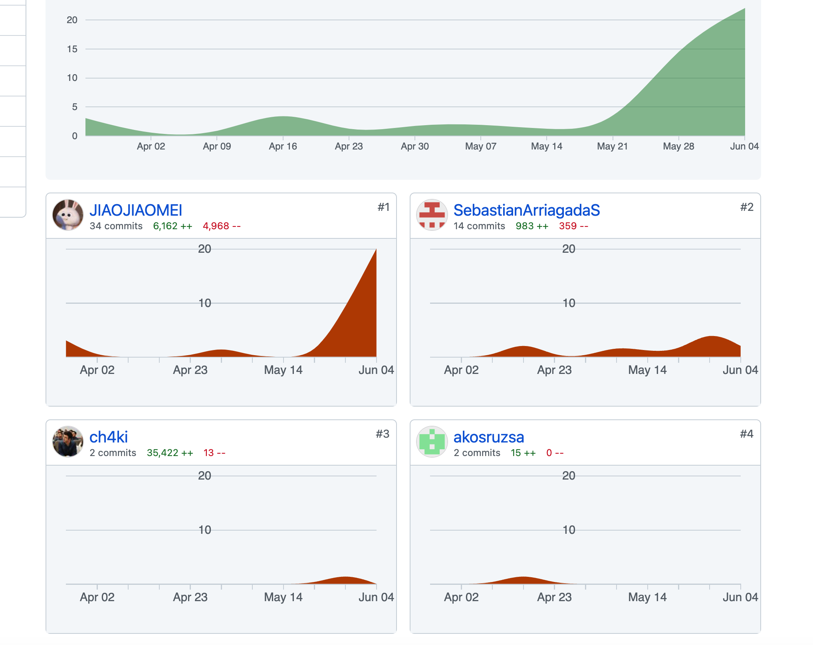

# Setup

Clone the project: Use a Git tool to clone the project code to your local machine. Execute the following command in the command line:

```bash
git clone https://github.com/JIAOJIAOMEI/VigilHeat-project.git
```
Navigate to the project directory: Use the `cd` command to navigate into the cloned project's directory:

```bash
cd VigilHeat-project/source code
```

Create and activate a virtual environment: It's generally a good practice to create a virtual environment to isolate the project's dependencies. In the command line, execute the following commands to create and activate a virtual environment:

On Windows:

```bash
python -m venv myenv  # Create a virtual environment named'myenv'
myenv\Scripts\activate   # Activate the virtual environment
```

On macOS/Linux:

```bash
python3 -m venv myenv # Create a virtual environment named 'myenv'
source myenv/bin/activate  # Activate the virtual environment
```

Replace `myenv` with the desired name for your virtual environment. Once activated, your command line prompt will be prefixed with the name of the virtual environment.

Install dependencies: Check if the project has a `requirements.txt` file listing the required dependencies. If it does, run the following command to install those dependencies:

```python
pip install -r requirements.txt
```

# Project structure

Here is the project structure based on the provided files:

```bash
- main.py: The main script responsible for running the people counting system.
- stream_handler.py: A module that handles video streaming and frame processing.
- heatmap_generator.py: A module that generates a heatmap based on the detected people.
- person_detector.py: A module containing the implementation of the person detection algorithm.
- histogram_generator.py: A module that generates a histogram based on the people count data.
- requirements.txt: A file listing the required dependencies for the project.
- people_counting_at_cashier.py: A script that demonstrates the people counting system at a cashier location.
- yolov8l.pt: A pre-trained YOLOv8 model's weight file for object detection.

Please note that this structure assumes all files are present in the same directory. 

```

# Teaser Images/video

## Free plan

### general people counting


### general people counting and object detections


### People counting at a specific area


### Sending notifications in real time

If you use the free version, you will receive real-time alerts when the number of people reaches certain upper and lower limits, and these alerts will be sent via email.




### if you consider a free plan

```python
# Run with a specific input video file
python3 people_counting_at_cashier.py --input input_video.mp4

# Use a webcam as input:
python3 people_counting_at_cashier.py --input webcam

# Set the webcam resolution:
python3 people_counting_at_cashier.py --webcam-resolution 1280 720

# Specify an output video file:
python3 people_counting_at_cashier.py --input input_video.mp4 --output path/to/output.mp4

# Adjust the number of frames to skip:
python3 people_counting_at_cashier.py --input input_video.mp4 --output path/to/output.mp4 --skip-frames 5

# People counting and object detections:
python3 people_counting_at_cashier1.py --input input_video.mp4

# Enable email notifications and provide an email address:
python3 people_counting_at_cashier.py --input input_video.mp4 --output path/to/output.mp4 --email your-email@example.com
```

Replace the **YOUR_EMAIL** variable with your email address, and generate an application-specific password from your email service provider (e.g., Google) to authenticate the script without revealing your actual account password. 

```python
YOUR_EMAIL = "your-email@example.com"
YOUR_PASSWORD = "your-generated-application-specific-password"
```

## Plus version

In the Plus version, you have access to a control panel where you can monitor real-time people flow and the status of people at the cashier area. Additionally, you retain all the rights and benefits available in the free version. With the Plus version, the following features are available:

1. Real-time Monitoring: The control panel provides a live view of the people flow, allowing you to track the movement and density of people in different areas. This helps you gain insights into the overall crowd dynamics and make informed decisions.
2. Cashier Area Monitoring: The control panel includes a dedicated section to monitor the specific area around the cashier. This enables you to keep track of the number of people at the cashier, assess queue lengths, and optimize staffing accordingly.
3. Additional Analytical Insights: The Plus version may provide additional analytical features and visualizations to help you understand patterns, trends, and peak hours of people flow. These insights can assist in optimizing operations and resource allocation.
4. Continued Free Version Benefits: Despite upgrading to the Plus version, you retain all the rights and benefits available in the free version. This includes real-time alerts for upper and lower limits, email notifications, and the ability to track people count within a user-defined ROI.

If you would like a clearer teaser video of the project, you can find a video demonstration in the "output_video.mp4" file located in the "source code" folder. The following is a just compressed gif.


```python
python3 main.py
```

These two files are save as people_count.png and poeple_count.csv after each run.<br />These files can be further used to predict peak hours, but I don't have time to implement that.

# MVP scope completion

## High Priority

1. Monitoring customer flow during peak hours: the code fulfills this requirement by counting the number of people detected in the video or webcam feed. This information helps in understanding customer flow. **Completion: 100%**
2. Predicting peak hours:  while the code does not have explicit functionality for predicting peak hours, we have implemented a feature to record and save the people flow data every day. This data can be utilized for future analysis and prediction of peak hours, allowing us to make informed decisions. Therefore, it can be considered as partial completion, **Completion: 50%**
3. Real-time alerts for queue length: the code sends real-time email notifications when the people count exceeds or falls below certain thresholds, helping to identify potential queue length issues. **Completion: 100%**

## Medium Priority

1. Analyzing checkout lane efficiency: the current code does not have built-in functionality to analyze checkout lane configurations and measure their efficiency. However, with the recorded people flow data, we can manually analyze the checkout lane utilization and identify any bottlenecks or areas for improvement. While this requires manual analysis, it provides a starting point for evaluating checkout lane efficiency. **Completion: 30-50% (Manual analysis possible using recorded data)**
2. Reviewing staff performance during peak hours:  the code does not include specific functionality to directly analyze staff performance. However, by correlating the recorded people flow data with staffing schedules, we can gain insights into staff availability and determine their effectiveness during peak hours. This analysis would require manual examination of the data and coordination with staffing records. Thus, while not automated, it allows for an evaluation of staff performance. **Completion: 30-50% (Manual analysis possible using recorded data and staffing schedules)**

## Low Priority

1. Tracking customer satisfaction levels: the code currently does not have specific functionality to track customer satisfaction levels. However, we can leverage the email notifications sent to customers regarding the people count to include a brief survey or feedback form. By including a short questionnaire in the email, we can gather valuable insights and feedback from customers regarding their satisfaction levels. Although this functionality is not directly implemented in the code, it provides an opportunity to collect customer feedback alongside the people count notifications. **Completion:10%( Potential for gathering customer feedback through email notifications).**
# Target KPI realization
Our Target User KPIs for the end of the semester are: 

1. Detection accuracy of at least 75%. 
2. Detection frequency of at least 10 frames per second. 

Firstly, we achieved an impressive detection accuracy of 85% with our trained YOLO model, surpassing our target of 75%. This showcases the model's effectiveness in accurately identifying and detecting objects.

Secondly, we successfully implemented a skip frames mechanism to achieve a detection frequency of at least 10 frames per second. By intelligently skipping frames at specific intervals, we optimized processing speed while maintaining high accuracy. This ensures our system can efficiently handle real-time video streams, meeting our desired performance criteria. It's worth noting that even without skipping any frames, the current code still satisfies the desired performance requirements.

In summary, we have accomplished our goals by achieving exceptional detection accuracy and ensuring real-time processing capabilities in our system.

# A screenshot for the commits



# For other assignments

**Team is Ready for Action (PDF of idea submitted)**: Jiaojiao took the initiative to draft the entire PDF document outlining our project idea. The other team members provided some suggestions, and made minor modifications.

**Market, Users & KPIs**: Jiaojiao initially drafted the PDF document for this section, and the other team member, Arriagada Silva Sebastián Ignacio, made significant revisions to it.

**User Interviews & Stories**: The main responsibility for this task was undertaken by Rúzsa Ákos, including conducting user interviews and writing the corresponding documentation.

**MVP User Stories**: Arriagada Silva Sebastián Ignacio took the lead in drafting the initial PDF document for this section, and Jiaojiao subsequently made significant additions and modifications.

**Retrospective**: Jiaojiao doesn't know or remember this one.

**The code**: see the contribution.

# reference

https://github.com/saimj7/People-Counting-in-Real-Time

https://github.com/ultralytics/ultralytics
